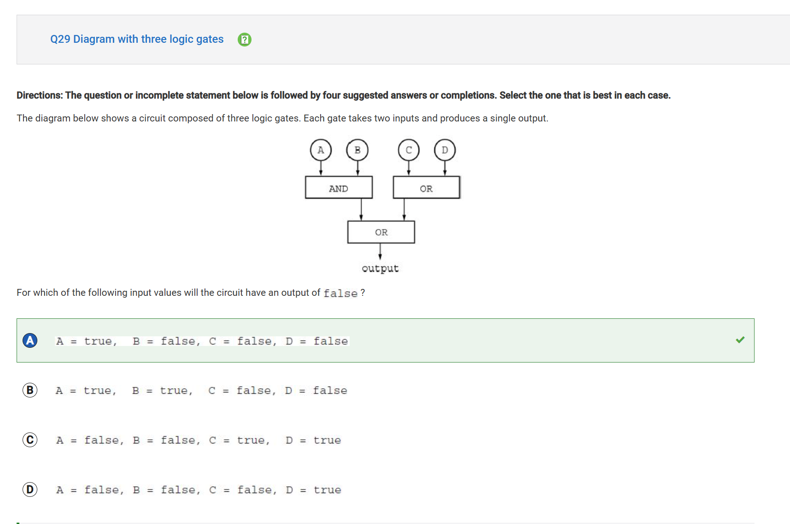

# MCQ Blog

I got 66/66 on this assignment so this blog will primarily be focused on questions I spent the longest time on and had the most difficulty with.

I will go over each Big Idea from 1-6 and go through the question I found most difficult for each of those Big Ideas.

Proof of Score:  

## Big Idea 1

I found this question to be the most challenging for this portion of the practice exam because of the actual applied logic required to answer this question. I had to manually go through each of the steps in both of the proposed code solutions and figure out which one worked in accordance to the answers, which caused an influx in time to solve this problem.

Answer choice C is correct for this question because it doesnt calculate the averga after every iteration, but rather does it at the end.  

## Big Idea 2

This question was the most time consuming because it is about logic gates. While I have some past experience with how logic gates work, I needed a little refresher to get the juices flowing again. I manually tried every option choice to check its output, and thus landed at option choice A.

This answer is correct because if we consider the following table,

| Variable | Value  |
|----------|--------|
| A        | True   |
| B        | False  |
| C        | False  |
| D        | False  |

A AND B gives False, C OR D gives False, and False OR False outputs False, which is what we were aiming for.